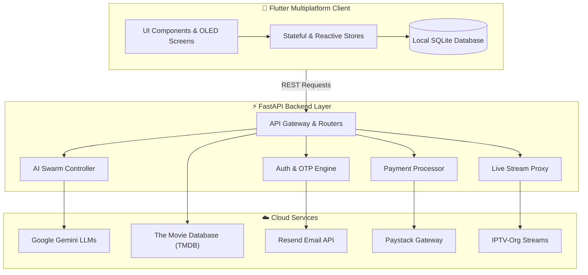
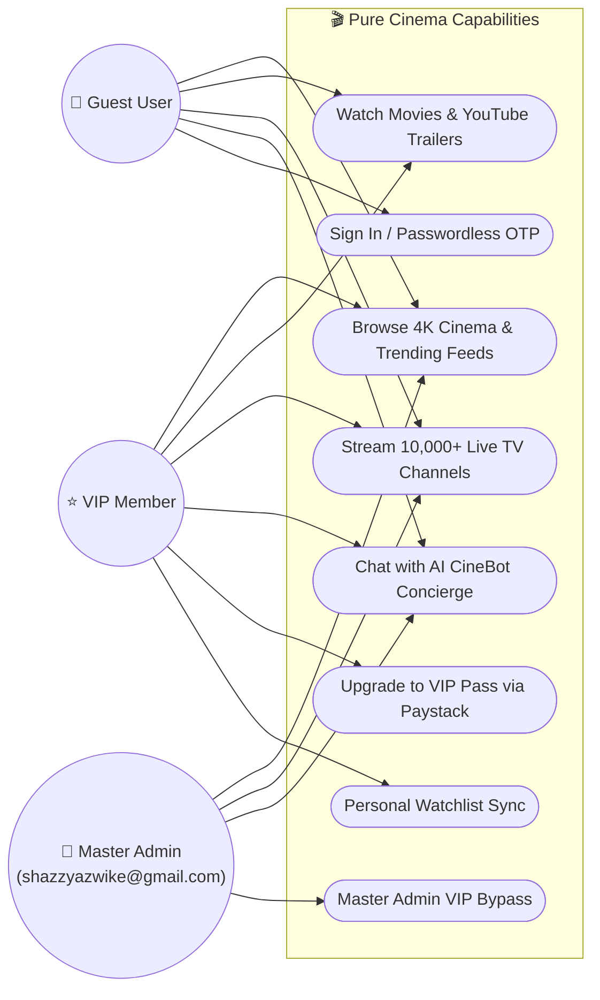
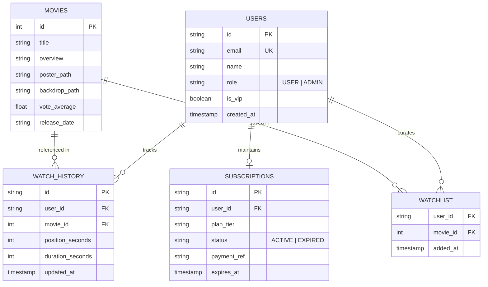
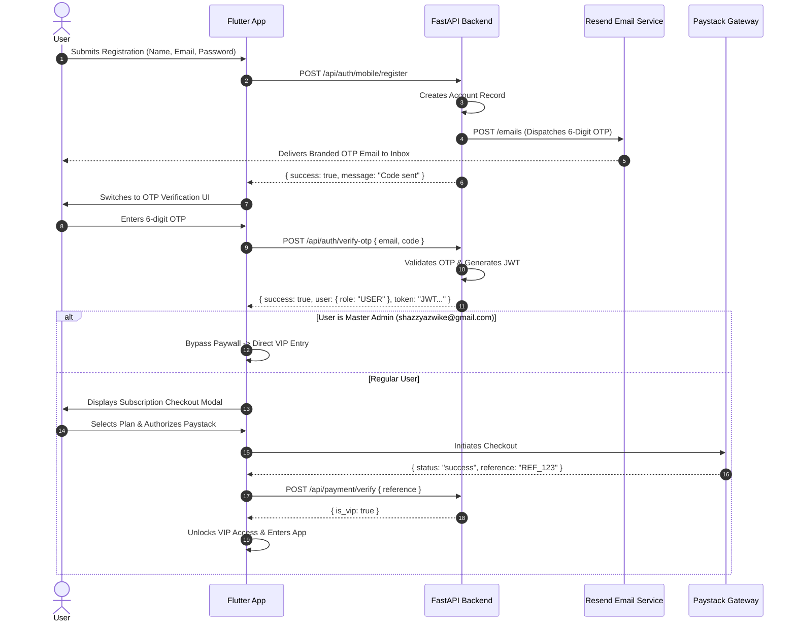
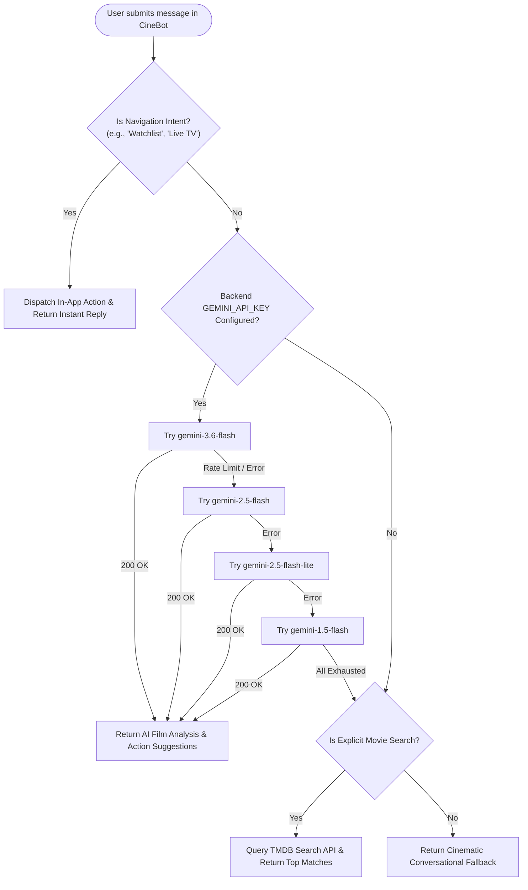

# 🎬 Pure Cinema

<div align="center">


### *Uncompromised 4K Cinema, 10,000+ Global TV Channels & Autonomous AI CineBot*

[](https://flutter.dev)
[](https://fastapi.tiangolo.com)
[](https://python.org)
[](https://aistudio.google.com)
[](LICENSE)

</div>

---

## 📖 Table of Contents

- [Overview](#-overview)
- [Design Philosophy](#-design-philosophy)
- [Comprehensive Feature Suite](#-comprehensive-feature-suite)
  - [1. 4K Cinema Streaming & Player](#1-4k-cinema-streaming--player)
  - [2. 10,000+ Worldwide Live TV](#2-10000-worldwide-live-tv)
  - [3. AI CineBot Concierge](#3-ai-cinebot-concierge)
  - [4. Authentication & Passwordless OTP System](#4-authentication--passwordless-otp-system)
  - [5. VIP Memberships & Paystack Gateway](#5-vip-memberships--paystack-gateway)
  - [6. Local-First Sync & SQLite Persistence](#6-local-first-sync--sqlite-persistence)
- [System Architecture](#-system-architecture)
- [Architecture & Sequence Diagrams](#-architecture--sequence-diagrams)
  - [System Layer Diagram](#system-layer-diagram)
  - [Use Case Diagram](#use-case-diagram)
  - [Entity-Relationship Diagram (ERD)](#entity-relationship-diagram-erd)
  - [Authentication & VIP Paywall Sequence](#authentication--vip-paywall-sequence)
  - [AI CineBot Model Rotator Flow](#ai-cinebot-model-rotator-flow)
- [API Reference](#-api-reference)
- [Quick Start Guide](#-quick-start-guide)
- [Environment Configuration](#-environment-configuration)
- [Production Deployment](#-production-deployment)
- [Project Directory Structure](#-project-directory-structure)
- [License & Credits](#-license--credits)

---

## 🌟 Overview

**Pure Cinema** is an enterprise-grade, cross-platform media streaming application engineered with **Flutter** (Web, iOS, Android, macOS, Windows, Linux) and powered by a asynchronous **FastAPI** backend microservice.

Built from the ground up for movie aficionados and cinephiles, Pure Cinema unifies curated 4K cinema catalogs, TMDB-backed metadata, YouTube trailer embeds, resilient global IPTV streaming, conversational AI assistant intelligence via Google Gemini, and secure Paystack monetization in one cohesive experience.

---

## 🎨 Design Philosophy

Pure Cinema is designed around an **OLED Obsidian Monochrome Aesthetic**:
* **Deep Pitch Black (`#050505`)**: Eliminates eye strain and delivers infinite contrast on OLED/AMOLED displays.
* **Porcelain & Ceramic Highlights (`#FFFFFF` & `#E4E4E7`)**: Minimalist floating navigation pills, glowing badges, and crisp typographic hierarchy using **S-Core Dream** and **Outfit** font families.
* **Micro-Animations & Smooth Transitions**: 60fps hero animations, expandable channel guides, gesture-driven HUD controls, and interactive modal sheets.
* **Responsive Multi-Form Factor Engine**: Seamlessly shifts between dual-column desktop/web viewports and compact gesture-optimized mobile layouts.

---

## ✨ Comprehensive Feature Suite

### 1. 4K Cinema Streaming & Player
* **Smart Stream Matching Engine**: Automatic playback resolution failover with support for MP4, HLS (.m3u8), and adaptive bitrates.
* **Interactive Player HUD**:
  - Direct touch gestures (tap to toggle controls with 4-second auto-hide).
  - High-precision live DVR scrubber and timestamp tracker.
  - Quick ±10-second skip buttons, instant mute toggle, and dynamic playback speed selector (`0.75x` to `2.0x`).
* **YouTube Official Trailers**: Integrated YouTube iframe player with responsive positioning and top-tier controls.
* **Episodes & Chapters Drawer**: Switch seamlessly between multi-part films, episodes, and bonus features with live state indicators.
* **Curated Metadata powered by TMDB**: Detailed synopses, release years, review scores, genre categorization, and complete cast/crew carousels.

---

### 2. 10,000+ Worldwide Live TV
* **Global Channel Directory**: Over 10,000+ free-to-air global broadcast streams aggregated via dynamic IPTV-org sync.
* **Multi-Tier Filtering**:
  - **Category Tabs**: All Channels, Movies, News, Sports, Documentary, Entertainment, Music, Kids, and Animation.
  - **Country Flag Badges**: Quick regional switching across 50+ countries (`🇺🇸 US`, `🇬🇧 UK`, `🇫🇷 FR`, `🇩🇪 DE`, `🇯🇵 JP`, etc.) with automatic ISO flag generation.
* **Instant Client-Side Search**: Zero-latency search bar with real-time text query filtering.
* **CORS Stream Proxy (`/stream-proxy`)**: FastAPI streaming proxy that bridges geo-restricted or CORS-blocked live feeds directly to web browsers.
* **Orientation-Aware Mobile Layout**: Intelligent layout transitions that scale the player on keyboard open and support full immersive landscape playback.

---

### 3. AI CineBot Concierge
* **Powered by Google Gemini**: Deeply conversational AI agent tailored specifically for film criticism, narrative explanations, Easter eggs, and cinema lore.
* **Multi-Model Rotator Engine**: Robust fallback chain routing requests through Google Gemini models:
  1. `gemini-3.6-flash`
  2. `gemini-2.5-flash`
  3. `gemini-2.5-flash-lite`
  4. `gemini-1.5-flash`
  5. `gemini-1.5-flash-8b`
* **In-App Action Dispatcher**: The AI CineBot doesn't just chat—it controls the app using structured JSON commands:
  - `NAVIGATE_TAB`: Switch tabs autonomously (e.g. "Take me to Live TV" $\rightarrow$ Tab index `1`).
  - `OPEN_MOVIE`: Directly launch movie details or player modals.
* **Cold-Start Resilience**: 30-second client timeout handles free-tier cloud backend spin-ups gracefully.

---

### 4. Authentication & Passwordless OTP System
* **Dual Auth Strategies**:
  - Traditional **Email & Password** authentication with bcrypt-grade security.
  - 1-Click **Passwordless Login / Registration** via 6-digit One-Time Passwords (OTP).
* **Automated Post-Registration Verification**: When creating a new account, a 6-digit OTP is automatically generated and dispatched to the user's inbox.
* **Branded Email Delivery via Resend**: Beautifully styled dark-mode HTML email templates dispatched directly using the **Resend REST API**.
* **Master Admin Privilege Layer**:
  - Master Admin account (`shazzyazwike@gmail.com`) automatically receives permanent `ADMIN` privileges and zero-paywall VIP status across all devices.

---

### 5. VIP Memberships & Paystack Gateway
* **Tiered Subscription Plans**:
  - **Cinephile Monthly**: Full 4K HDR access + Unlimited Live TV.
  - **Studio Premiere (Quarterly)**: Multi-device sync + Offline downloads.
  - **Founder Lifetime Pass**: Permanent VIP access + AI CineBot priority tokens.
* **Paystack Payment Integration**:
  - Live card, bank, and USSD payments.
  - Built-in Mock Mode for rapid developer testing and sandbox simulations.
* **Post-Verification Paywall Enforcement**: Standard users are seamlessly guided to the VIP subscription checkout modal upon verifying their email.

---

### 6. Local-First Sync & SQLite Persistence
* **Instant Resumption**: Local database cache stores watch history, video playback positions (seconds), and custom watchlists with 0ms read latency.
* **Cloud Sync**: Automatically synchronizes watchlist items and progress to the FastAPI backend whenever network connectivity is restored.

---

## 🏛️ System Architecture

Pure Cinema operates on a **Four-Tier Distributed Architecture**:

```
┌─────────────────────────────────────────────────────────────────────────┐
│                           1. CLIENT TIER                                │
│                   Flutter (Web / iOS / Android / Desktop)               │
│  ┌─────────────────────────┐ ┌───────────────────┐ ┌──────────────────┐ │
│  │   Cinema Video Player   │ │  IPTV Live Guide  │ │ AI CineBot HUD   │ │
│  └─────────────────────────┘ └───────────────────┘ └──────────────────┘ │
│  ┌────────────────────────────────────────────────────────────────────┐ │
│  │     Local SQLite Database / SharedPreferences (0ms Local State)    │ │
│  └────────────────────────────────────────────────────────────────────┘ │
└────────────────────────────────────┬────────────────────────────────────┘
                                     │ HTTPS / JSON / CORS Proxy
                                     ▼
┌─────────────────────────────────────────────────────────────────────────┐
│                           2. BACKEND GATEWAY                            │
│                         FastAPI (Python 3.10+)                          │
│  ┌───────────────┐ ┌───────────────┐ ┌────────────────┐ ┌─────────────┐ │
│  │ /api/auth     │ │ /api/agent    │ │ /api/iptv      │ │ /api/payment│ │
│  │ JWT & OTP     │ │ Gemini Swarm  │ │ Stream Proxy   │ │ Paystack    │ │
│  └───────────────┘ └───────────────┘ └────────────────┘ └─────────────┘ │
└────────────────────────────────────┬────────────────────────────────────┘
                                     │ Async Connectors
                                     ▼
┌─────────────────────────────────────────────────────────────────────────┐
│                        3. EXTERNAL INTEGRATIONS                         │
│  ┌───────────────────────┐ ┌───────────────────┐ ┌───────────────────┐  │
│  │   Google Gemini API   │ │   TMDB v3 API     │ │    Resend API     │  │
│  │   Cognitive AI Swarm  │ │   Metadata Engine │ │    Transactional  │  │
│  └───────────────────────┘ └───────────────────┘ └───────────────────┘  │
│  ┌───────────────────────┐ ┌───────────────────┐                        │
│  │   Paystack Gateway    │ │   IPTV-Org M3U8   │                        │
│  │   Payment Processor   │ │   Global Channels │                        │
│  └───────────────────────┘ └───────────────────┘                        │
└─────────────────────────────────────────────────────────────────────────┘
```

---

## 📐 Architecture & Sequence Diagrams

### System Layer Diagram



---

### Use Case Diagram



---

### Entity-Relationship Diagram (ERD)



---

### Authentication & VIP Paywall Sequence



---

### AI CineBot Model Rotator Flow



---

## 📡 API Reference

| Method | Endpoint | Description | Auth Required |
| :--- | :--- | :--- | :--- |
| `GET` | `/health` | Server status and Gemini AI readiness | No |
| `POST` | `/api/auth/mobile/login` | Authenticate with email & password | No |
| `POST` | `/api/auth/mobile/register` | Create account & trigger verification OTP | No |
| `POST` | `/api/auth/send-otp` | Generate & email 6-digit OTP code | No |
| `POST` | `/api/auth/verify-otp` | Verify 6-digit code and issue JWT | No |
| `POST` | `/api/auth/reset-password` | Reset password using verified code | No |
| `POST` | `/api/agent/chat` | Chat with Google Gemini AI CineBot | No |
| `GET` | `/api/iptv/channels` | Retrieve categorized live TV channels | No |
| `GET` | `/stream-proxy` | CORS bypass proxy for live HLS streams | No |
| `GET` | `/api/payment/plans` | Retrieve Paystack membership plans | No |
| `POST` | `/api/payment/verify` | Verify Paystack transaction reference | Yes |
| `GET` | `/api/movies/trending` | Fetch trending cinema titles from TMDB | No |

---

## ⚡ Quick Start Guide

### Prerequisites
* **Flutter SDK**: `3.19+` ([Install Flutter](https://flutter.dev/docs/get-started/install))
* **Python**: `3.10+` ([Install Python](https://python.org))
* **Git**: Installed on your operating system

---

### 1. Clone Repository
```bash
git clone https://github.com/JaimeCabary/Pure-Cinema-Flutter.git
cd Pure-Cinema-Flutter
```

---

### 2. Launch Backend Service
```bash
cd backend

# Create and activate virtual environment
python -m venv .venv
source .venv/bin/activate  # On Windows: .venv\Scripts\activate

# Install dependencies
pip install -r requirements.txt

# Start FastAPI server
python run.py
```
> **Backend URL**: `http://localhost:3000`  
> **Health Endpoint**: `http://localhost:3000/health`

---

### 3. Launch Flutter Client
Open a second terminal at the project root:
```bash
# Install Flutter dependencies
flutter pub get

# Run on Web (Chrome)
flutter run -d chrome

# Or run for Android / iOS / Desktop
flutter run
```

---

## 🔑 Environment Configuration

Create a `.env` file in the `backend/` directory (refer to [`backend/.env.example`](backend/.env.example)):

```env
PORT=3000
HOST=0.0.0.0

# TMDB API (Required for Movie Data & Posters)
TMDB_API_KEY=your_tmdb_api_key_here

# Google Gemini API (Required for AI CineBot)
GEMINI_API_KEY=your_gemini_api_key_here

# Resend API (Required for Transactional OTP Emails)
RESEND_API_KEY=your_resend_api_key_here
RESEND_FROM_EMAIL=onboarding@resend.dev

# Paystack API (Optional - Defaults to Test Mode if empty)
PAYSTACK_SECRET_KEY=sk_test_...
PAYSTACK_PUBLIC_KEY=pk_test_...

# JWT Token Secret
JWT_SECRET=your_super_secret_jwt_signing_key
```

---

## 🚀 Production Deployment

### 1-Click Backend Deployment on Render

This repository includes a pre-configured [`render.yaml`](render.yaml) Blueprint spec:

1. Go to [dashboard.render.com](https://dashboard.render.com/) $\rightarrow$ **New +** $\rightarrow$ **Blueprint**.
2. Connect `JaimeCabary/Pure-Cinema-Flutter`.
3. Render automatically provisions the Python 3.10 FastAPI service with native health check tracking.
4. Set your environment variables in the Render Dashboard (**Environment** tab).

### Frontend Web Hosting (Render / Vercel / Netlify)
1. Build production web bundle:
   ```bash
   flutter build web --release
   ```
2. Deploy the generated `build/web` folder to any static hosting provider.

---

## 📁 Project Directory Structure

```text
Pure-Cinema-Flutter/
├── lib/                               # Flutter Frontend Codebase
│   ├── models/                        # LiveChannel, Movie, CastMember models
│   ├── screens/                       # MainNav, Home, LiveTV, Watch, Search, Auth
│   ├── services/                      # TMDB, IPTV, Agent, Payment, Database
│   ├── theme/                         # S-Core Dream typography & OLED palette
│   └── widgets/                       # MovieCards, Modals, Subscription, CinemaLogo
├── backend/                           # FastAPI Backend Service
│   ├── app/
│   │   ├── models/                    # Pydantic schemas & request validation
│   │   ├── routers/                   # Endpoints (/auth, /agent, /iptv, /payment)
│   │   ├── services/                  # Gemini Rotator, Resend Email, IPTV Proxy
│   │   ├── config.py                  # Settings & environment parser
│   │   └── main.py                    # FastAPI entrypoint & CORS configuration
│   ├── pyproject.toml                 # Backend package specification
│   ├── requirements.txt               # PIP dependencies
│   └── run.py                         # Production server runner
├── web/                               # Web runner, manifest.json & splash configs
├── render.yaml                        # 1-Click Render Blueprint infrastructure spec
└── README.md                          # Comprehensive documentation
```

---

## 📄 License & Credits

Distributed under the **MIT License**. See `LICENSE` for details.

<div align="center">
  <br/>
  <b>Pure Cinema Studios · 2026</b><br/>
  <i>Crafted for cinephiles, stream enthusiasts, and developers worldwide.</i>
</div>
