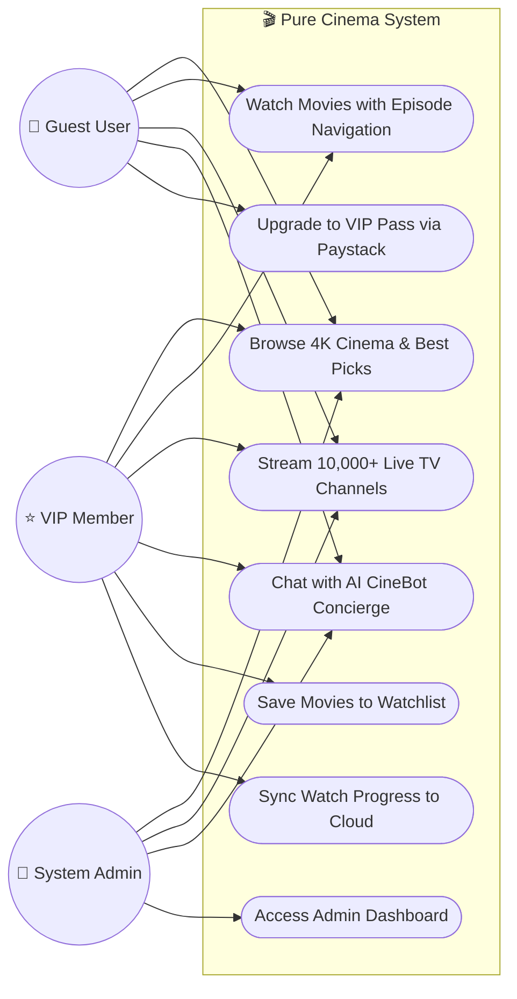
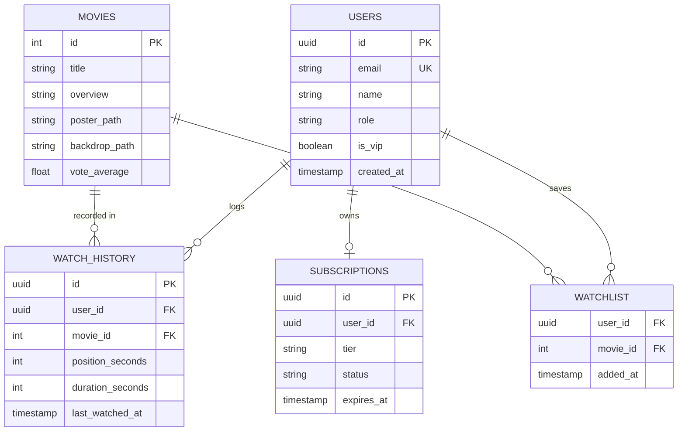

<div align="center">

## 📖 About Pure Cinema

**Pure Cinema** is an ultra-modern, cross-platform streaming platform crafted with **Flutter** (Web, iOS, Android, Desktop) and a high-performance **FastAPI** backend.

Designed around a sleek **OLED obsidian monochrome aesthetic**, Pure Cinema unifies:

1. **Curated 4K Cinema & Trailers**: Instant streaming, multi-part episodes/chapters, resume-playback sync, and rich movie metadata powered by TMDB.
2. **10,000+ Worldwide Live TV**: Seamless low-latency live channels spanning news, sports, entertainment, and cinema from 50+ countries.
3. **AI CineBot Concierge**: A personalized conversational assistant powered by Google Gemini that answers film trivia, recommends movies, and executes in-app navigation.
4. **Resilient Local-First Sync & VIP Subscriptions**: Zero-latency local reads via SQLite/LocalStorage backed by cloud synchronization and secure Paystack payments.

---

## ✨ Key Features

### 🎞️ 1. True 4K Streaming & Cinema Player

* **Smart Stream Matching**: High-fidelity genre-matched streams (Sci-Fi, Anime, Blockbusters, Classics) with automatic failover.
* **Episodes & Multi-Part Features**: Built-in episodes drawer to switch between parts, seasons, and extra features.
* **Persistent Cinema HUD**: Floating back button, 10s skip controls, progress scrubber, and audio toggles.

### 📺 2. 10,000+ Global Live TV Channels

* **Categorized IPTV**: Explore channels by Country, Sports, News, Movies, Music, and Kids.
* **Dynamic Regional Filters**: Country flag chips with fast client-side searching.
* **Resilient Proxying**: Built-in backend stream proxy to bypass CORS restrictions on web browsers.

### 🤖 3. AI CineBot Concierge

* **Multi-Model Rotator**: Automatically routes through `gemini-2.5-flash`, `gemini-2.0-flash`, `gemini-1.5-flash`, and `gemini-1.5-pro` with rate-limit protection.
* **In-App Action Dispatcher**: The CineBot can autonomously navigate between screens, search movies, and open titles via structured JSON action commands.

### 💳 4. VIP Memberships & Paystack Checkout

* **Monochrome VIP Portal**: Interactive membership tiers (Monthly, Quarterly, Founder Lifetime) with geometric whorl aesthetics.
* **Dual Test/Live Mode**: Instant switch between Paystack Mock Test Mode and Live Card/Bank authorization.

### 📬 5. Transactional Security & Email Delivery

* **Instant Resend Integration**: Dispatches branded HTML verification codes and password reset tokens directly to users' inboxes.

---

## 🏛️ System Architecture

Pure Cinema employs a **Four-Tier Local-First Architecture**:

```
┌─────────────────────────────────────────────────────────────┐
│                      1. CLIENT LAYER                        │
│                   Flutter (Web / Mobile)                    │
│  - Instant UI rendering, Cinema Player, Floating Dock Dock  │
│  - Local SQLite Store: 0ms playback resume & cache          │
└──────────────────────────────┬──────────────────────────────┘
                               │  REST API / CORS Proxy
                               ▼
┌─────────────────────────────────────────────────────────────┐
│                       2. SYNC LAYER                         │
│                    FastAPI (Python 3.10+)                   │
│  - Auth & JWT Sessions, Dynamic Model Rotator, Sync Engine  │
└──────────────────────────────┬──────────────────────────────┘
                               │  Async Connectors
                               ▼
┌─────────────────────────────────────────────────────────────┐
│                   3. EXTERNAL SERVICES                      │
│  - Google Gemini AI (Concierge Chat & Action Protocols)     │
│  - TMDB v3 API (Movie Metadata, Backdrops, Credits)         │
│  - Paystack Gateway (VIP Pass Payments)                     │
│  - Resend API (Transactional Verification Emails)           │
│  - IPTV-Org (Worldwide Live Channel Streams)                │
└─────────────────────────────────────────────────────────────┘
```

---

## 📐 Diagrams & Specifications

### 🎯 Use Case Diagram



---

### 🗄️ Entity-Relationship Diagram (ERD)



---

## ⚡ Quick Start

### Prerequisites

* **Flutter SDK**: `3.19+` ([Install Flutter](https://flutter.dev/docs/get-started/install))
* **Python**: `3.10+` ([Install Python](https://python.org))
* **Git**: Installed on your system

---

### 1. Clone the Repository

```bash
git clone https://github.com/JaimeCabary/Pure-Cinema-Flutter.git
cd Pure-Cinema-Flutter
```

---

### 2. Configure & Start the Backend

```bash
cd backend

# Create virtual environment & install dependencies
python -m venv .venv
source .venv/bin/activate  # On Windows: .venv\Scripts\activate
pip install -r requirements.txt

# Run the FastAPI server
python run.py
```

> **Backend Service**: `http://localhost:3000`
> **API Health Check**: `http://localhost:3000/health`

---

### 3. Start the Flutter Client

Open a second terminal at the project root:

```bash
# Get Flutter packages
flutter pub get

# Run on Chrome / Web Browser
flutter run -d chrome

# Or run for Android / iOS
flutter run
```

---

## 🔑 Environment Variables

Configure `backend/.env` (see [`backend/.env.example`](backend/.env.example)):

| Variable                | Description                               | Required      | Default / Note                                                      |
| :---------------------- | :---------------------------------------- | :------------ | :------------------------------------------------------------------ |
| `PORT`                | Backend port binding                      | No            | `3000`                                                            |
| `HOST`                | Backend host address                      | No            | `0.0.0.0`                                                         |
| `TMDB_API_KEY`        | TMDB API key for movie metadata & credits | **Yes** | Obtain from[themoviedb.org](https://www.themoviedb.org/settings/api) |
| `GEMINI_API_KEY`      | Google Gemini API key for AI CineBot      | **Yes** | Obtain from[aistudio.google.com](https://aistudio.google.com/)       |
| `RESEND_API_KEY`      | Resend API key for verification emails    | **Yes** | Obtain from[resend.com](https://resend.com)                          |
| `RESEND_FROM_EMAIL`   | Sender email address for OTPs             | No            | `onboarding@resend.dev`                                           |
| `PAYSTACK_SECRET_KEY` | Paystack secret key                       | No            | Defaults to Mock Test Mode if empty                                 |
| `PAYSTACK_PUBLIC_KEY` | Paystack public key                       | No            | Defaults to Mock Test Mode if empty                                 |
| `JWT_SECRET`          | Secret key for signing auth tokens        | No            | Auto-configured fallback                                            |

---

## 📁 Project Structure

```text
Pure-Cinema-Flutter/
├── lib/                               # Flutter Client Codebase
│   ├── models/                        # Movie, CastMember, LiveChannel models
│   ├── screens/                       # MainNav, Home, LiveTV, Watch, Search, Auth
│   ├── services/                      # TMDB, IPTV, Agent, Payment, Database
│   ├── theme/                         # S-Core Dream typography & OLED monochrome theme
│   └── widgets/                       # MovieCards, Modals, AICineBot FAB, CinemaLogo
├── backend/                           # FastAPI Backend
│   ├── app/
│   │   ├── models/                    # Pydantic request/response schemas
│   │   ├── routers/                   # API routes (/auth, /agent, /iptv, /payment)
│   │   ├── services/                  # Gemini Rotator, Resend Email, IPTV Proxy
│   │   ├── config.py                  # Environment settings loader
│   │   └── main.py                    # FastAPI application entrypoint
│   ├── pyproject.toml                 # Package dependencies
│   ├── requirements.txt               # PIP requirements file
│   └── run.py                         # Production server runner
├── web/                               # Web runner, manifest.json & splash preloader
├── render.yaml                        # 1-Click Render Blueprint deployment spec
└── README.md                          # Project documentation
```

---

## 🚀 Production Deployment

### Backend on Render (1-Click Blueprint)

1. Navigate to [dashboard.render.com](https://dashboard.render.com/) $\rightarrow$ **New +** $\rightarrow$ **Blueprint**.
2. Connect `JaimeCabary/Pure-Cinema-Flutter`.
3. Render reads [`render.yaml`](render.yaml) and deploys your FastAPI web service automatically.

### Frontend on Web Hosts (Render / Vercel / Netlify)

1. Build the web release bundle:
   ```bash
   flutter build web --release
   ```
2. Deploy the generated `build/web` directory directly.

---

## 🤝 Contributing

Contributions are welcome! If you'd like to improve Pure Cinema:

1. **Fork the Repository**
2. **Create a Feature Branch**: `git checkout -b feature/amazing-feature`
3. **Commit Your Changes**: `git commit -m 'Add amazing feature'`
4. **Push to the Branch**: `git push origin feature/amazing-feature`
5. **Open a Pull Request**

Please ensure your code conforms to Flutter and Python best practices and preserves the **OLED monochrome design aesthetic**.

---

## 📄 License

Distributed under the **MIT License**. See `LICENSE` for more information.

<div align="center">
  <br/>
  <b>Pure Cinema Studios · 2026</b><br/>
  <i>Crafted with passion for cinema lovers & developers worldwide.</i>
</div>
