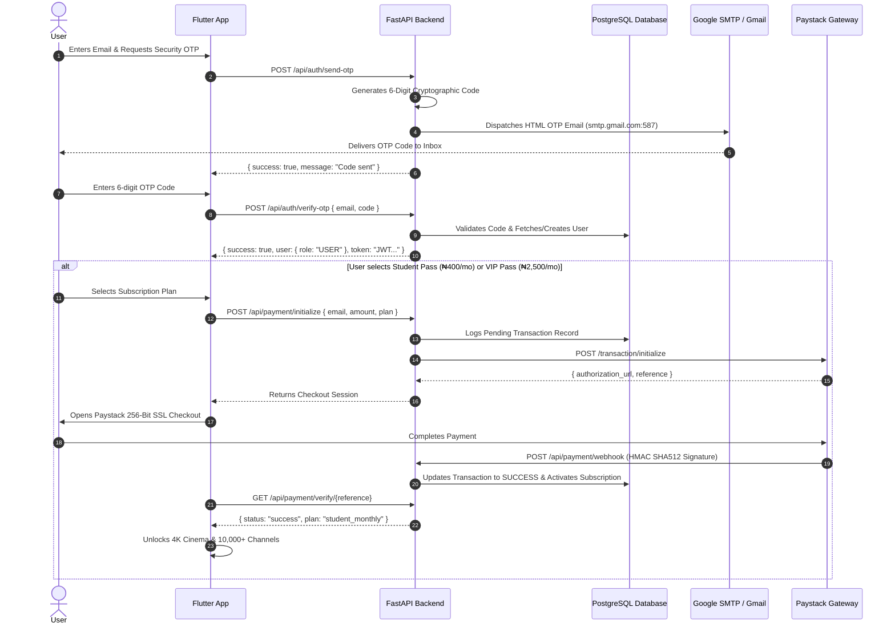

# 🎬 Pure Cinema

<div align="center">


### *Uncompromised 4K Cinema, 10,000+ Global TV Channels & Autonomous AI CineBot*

[](https://flutter.dev)
[](https://fastapi.tiangolo.com)
[](https://www.sqlalchemy.org)
[](https://www.postgresql.org)
[](https://paystack.com)
[](https://aistudio.google.com)
[](LICENSE)

</div>

---

## 📖 Table of Contents

- [Overview](#-overview)
- [Design Philosophy](#-design-philosophy)
- [Comprehensive Feature Suite](#-comprehensive-feature-suite)
  - [1. 4K Cinema Streaming, Video Quality & Data Saver](#1-4k-cinema-streaming-video-quality--data-saver)
  - [2. 10,000+ Worldwide Live TV & 5-Channel Free Preview](#2-10000-worldwide-live-tv--5-channel-free-preview)
  - [3. AI CineBot Concierge](#3-ai-cinebot-concierge)
  - [4. PostgreSQL ORM, Hashed Security & Google SMTP OTP](#4-postgresql-orm-hashed-security--google-smtp-otp)
  - [5. 4 Tier VIP Memberships & Paystack Integration](#5-4-tier-vip-memberships--paystack-integration)
  - [6. Public Domain & Open Source Cinema Vault](#6-public-domain--open-source-cinema-vault)
  - [7. Multi-Worker Server Fault Tolerance](#7-multi-worker-server-fault-tolerance)
- [System Architecture](#-system-architecture)
- [Architecture & Sequence Diagrams](#-architecture--sequence-diagrams)
- [API Reference](#-api-reference)
- [Quick Start Guide](#-quick-start-guide)
- [Environment Configuration](#-environment-configuration)
- [Production Deployment](#-production-deployment)
- [Project Directory Structure](#-project-directory-structure)
- [License & Credits](#-license--credits)

---

## 🌟 Overview

**Pure Cinema** is an enterprise-grade, cross-platform media streaming application engineered with **Flutter** (Web, iOS, Android, macOS, Windows, Linux) and powered by a high-concurrency **FastAPI** backend microservice backed by **PostgreSQL ORM** and **Paystack** payments.

Built from the ground up for movie aficionados and cinephiles, Pure Cinema unifies curated 4K cinema catalogs, TMDB-backed metadata, public domain films (Internet Archive & WikiFlix), YouTube trailer embeds, resilient global IPTV streaming, conversational AI assistant intelligence via Google Gemini, Google SMTP transactional email authentication, and secure Paystack monetization in one cohesive experience.

---

## 🎨 Design Philosophy

Pure Cinema is designed around an **OLED Obsidian Monochrome Aesthetic**:
* **Deep Pitch Black (`#050505`)**: Eliminates eye strain and delivers infinite contrast on OLED/AMOLED displays.
* **Porcelain & Ceramic Highlights (`#FFFFFF` & `#E4E4E7`)**: Minimalist floating navigation pills, glowing badges, and crisp typographic hierarchy using **S-Core Dream** and **Outfit** font families.
* **Micro-Animations & Smooth Transitions**: 60fps hero animations, expandable channel guides, gesture-driven HUD controls, and interactive modal sheets.
* **Responsive Multi-Form Factor Engine**: Seamlessly shifts between dual-column desktop/web viewports and compact gesture-optimized mobile layouts.

---

## ✨ Comprehensive Feature Suite

### 1. 4K Cinema Streaming, Video Quality & Data Saver
* **Smart Stream Matching Engine**: Automatic playback resolution failover with support for MP4, HLS (.m3u8), and adaptive bitrates.
* **Video Quality Selector & Bandwidth Saver**:
  - `4K Ultra HD (2160p)`: Master Studio Bitrate (Highest Quality).
  - `1080p Full HD`: Standard High-Definition.
  - `720p HD (Data Saver)`: 50% Mobile Data Savings.
  - `480p SD (Mobile Saver)`: 75% Mobile Data Savings (Smooth on 3G).
  - `360p Low Bandwidth`: Ultra-low bandwidth mode (~300MB/hr).
* **Interactive Player HUD**:
  - Direct touch gestures (tap to toggle controls with 4-second auto-hide).
  - High-precision live DVR scrubber and timestamp tracker.
  - Quick ±10-second skip buttons, instant mute toggle, and dynamic playback speed selector (`0.75x` to `2.0x`).

---

### 2. 10,000+ Worldwide Live TV & 5-Channel Free Preview
* **Global Channel Directory**: Over 10,000+ free-to-air global broadcast streams aggregated via dynamic IPTV-org sync.
* **Free Preview & VIP Access Control**:
  - Non-paid users get **5 free live channels** (`Pure Cinema TV 4K`, `00s Replay Cinema`, `FilmRise Free Movies`, `Bloomberg TV News`, `Red Bull TV Sports`).
  - Channels 6+ feature a `VIP 🔒` badge and prompt the subscription modal when tapped.
* **CORS Stream Proxy (`/stream-proxy`)**: FastAPI streaming proxy that bridges geo-restricted or CORS-blocked live feeds directly to web browsers.

---

### 3. AI CineBot Concierge
* **Powered by Google Gemini**: Deeply conversational AI agent tailored specifically for film criticism, narrative explanations, Easter eggs, and cinema lore.
* **Multi-Model Rotator Engine**: Robust fallback chain routing requests through Google Gemini models:
  1. `gemini-3.6-flash`
  2. `gemini-2.5-flash`
  3. `gemini-2.5-flash-lite`
  4. `gemini-1.5-flash`
  5. `gemini-1.5-flash-8b`
* **In-App Action Dispatcher**: The AI CineBot doesn't just chat—it controls the app using structured JSON commands (`NAVIGATE_TAB`, `OPEN_MOVIE`, `SHOW_TRAILER`).

---

### 4. PostgreSQL ORM, Hashed Security & Google SMTP OTP
* **SQLAlchemy ORM Data Persistence**:
  - `UserModel`: Account credentials, hashed passwords, roles (`USER`/`ADMIN`), and metadata.
  - `SubscriptionModel`: Active user subscriptions (`student_monthly`, `vip_monthly`, `ultra_quarterly`, `founder_lifetime`), start/end dates, and admin flags.
  - `TransactionModel`: Full audit log of all Paystack transactions (`reference`, `amount`, `channel`, `gateway_response`, `raw_payload`).
  - `WatchlistItemModel`: User saved movies and TV shows.
* **Native `bcrypt` Password Hashing**: Zero plain-text passwords stored in the database.
* **Google SMTP Email Dispatch (`smtp.gmail.com:587`)**:
  - Sends cryptographically random 6-digit OTP verification codes directly to the user's inbox using Gmail App Passwords.
  - Automatic fallback to Resend API (`RESEND_API_KEY`) if Google SMTP is unconfigured.
* **Institutional Student Email Auto-Verification**:
  - Recognizes `.edu`, `.edu.ng`, `.ac.uk`, `.sch.ng`, `.edu.gh`, `.edu.za`, `.stu.` domains for student verification.

---

### 5. 4 Tier VIP Memberships & Paystack Integration
* **4 Tier Subscription Categories**:
  - 🎓 **Student Cinema Pass**: **₦400 / Month** *(1080p FHD, 1 Screen, AI CineBot)* - *Cheapest Category*
  - 👑 **Pure Cinema VIP Pass**: **₦2,500 / Month** *(4K HDR 60 FPS, Spatial Audio)*
  - 🚀 **Cinema Ultra Pass**: **₦6,500 / 3 Months** *(4 Screens / Family Sharing)*
  - 💎 **Founder Lifetime Pass**: **₦25,000 / Lifetime** *(VIP Gold Badge, Direct Studio Bitrate)*
* **Production Paystack Gateway**:
  - `POST /api/payment/initialize`: Initializes Paystack transaction & logs pending attempt in PostgreSQL.
  - `GET /api/payment/verify/{ref}`: Queries Paystack verification API & activates user subscription in PostgreSQL.
  - `POST /api/payment/webhook`: Asynchronous webhook listener with **HMAC SHA512 signature validation** (`x-paystack-signature`).
  - 👑 **Master Admin Zero-Paywall Bypass**: 1-click instant lifetime VIP pass activation for master admin accounts.

---

### 6. Public Domain & Open Source Cinema Vault
* **Legal Public Domain Catalog Integration**:
  - Server-side integration with **Internet Archive API** (`archive.org`), **WikiFlix**, **Wikimedia Commons**, and **Prelinger Archives**.
  - Modern open-source cinema masterpieces (*Big Buck Bunny*, *Tears of Steel*, *Sintel*, *Night of the Living Dead*, *Charade*, *The General*).
  - Endpoint `GET /api/movies/archive-search?query=...` queries tens of thousands of free public-domain titles dynamically.

---

### 7. Multi-Worker Server Fault Tolerance
* **Process Clustering**: Production runner uses Uvicorn worker clustering (`uvicorn app.main:app --workers 4`).
* **Instant Worker Recovery**: If a worker process crashes, Uvicorn re-spawns it in milliseconds while sister workers serve incoming traffic without dropped connections.
* **Stateless Architecture**: Server RAM retains zero state; all user sessions and active subscriptions persist in PostgreSQL.

---

## 🏛️ System Architecture

```text
┌─────────────────────────────────────────────────────────────────────────┐
│                           1. CLIENT TIER                                │
│                   Flutter (Web / iOS / Android / Desktop)               │
│  ┌─────────────────────────┐ ┌───────────────────┐ ┌──────────────────┐ │
│  │   Cinema Video Player   │ │  IPTV Live Guide  │ │ AI CineBot HUD   │ │
│  └─────────────────────────┘ └───────────────────┘ └──────────────────┘ │
│  ┌────────────────────────────────────────────────────────────────────┐ │
│  │     Local SQLite Database / SharedPreferences (0ms Local State)    │ │
│  └────────────────────────────────────────────────────────────────────┘ │
└────────────────────────────────────┬────────────────────────────────────┘
                                     │ HTTPS / JSON / CORS Proxy
                                     ▼
┌─────────────────────────────────────────────────────────────────────────┐
│                           2. BACKEND GATEWAY                            │
│                 FastAPI (Python 3.10+) + SQLAlchemy ORM                 │
│  ┌───────────────┐ ┌───────────────┐ ┌────────────────┐ ┌─────────────┐ │
│  │ /api/auth     │ │ /api/agent    │ │ /api/iptv      │ │ /api/payment│ │
│  │ bcrypt & OTP  │ │ Gemini Swarm  │ │ Stream Proxy   │ │ Paystack    │ │
│  └───────────────┘ └───────────────┘ └────────────────┘ └─────────────┘ │
└───────────────────┬─────────────────────────────────┬───────────────────┘
                    │                                 │
                    ▼                                 ▼
┌──────────────────────────────────────┐ ┌────────────────────────────────┐
│      3. DATABASE PERSISTENCE         │ │    4. EXTERNAL INTEGRATIONS    │
│  ┌────────────────────────────────┐  │ │  ┌──────────────────────────┐  │
│  │   PostgreSQL (Supabase/Cloud)  │  │ │  │   Google Gemini API      │  │
│  │   Users, Subs, Transactions    │  │ │  │   TMDB v3 API            │  │
│  └────────────────────────────────┘  │ │  │   Google SMTP (Gmail)    │  │
│  ┌────────────────────────────────┐  │ │  │   Paystack Gateway       │  │
│  │   SQLite Fallback Engine       │  │ │  │   Internet Archive API   │  │
│  └────────────────────────────────┘  │ │  └──────────────────────────┘  │
└──────────────────────────────────────┘ └────────────────────────────────┘
```

---

## 📐 Architecture & Sequence Diagrams

### Authentication & Paystack Subscription Sequence



---

## 📡 API Reference

| Method | Endpoint | Description | Auth Required |
| :--- | :--- | :--- | :--- |
| `GET` | `/health` | Server health, Gemini AI readiness, and DB status | No |
| `POST` | `/api/auth/mobile/login` | Authenticate with email & bcrypt password | No |
| `POST` | `/api/auth/mobile/register` | Create account with hashed password | No |
| `POST` | `/api/auth/send-otp` | Generate & send random 6-digit OTP via Google SMTP | No |
| `POST` | `/api/auth/verify-otp` | Verify 6-digit code and issue JWT token | No |
| `GET` | `/api/auth/me` | Fetch active user profile and subscription state | Bearer JWT |
| `POST` | `/api/agent/chat` | Chat with Google Gemini AI CineBot | No |
| `GET` | `/api/iptv/channels` | Retrieve categorized live TV channels | No |
| `GET` | `/stream-proxy` | CORS bypass proxy for live HLS streams | No |
| `GET` | `/api/payment/plans` | Retrieve Paystack membership plans (4 Tiers) | No |
| `POST` | `/api/payment/initialize` | Initialize Paystack transaction & log attempt in DB | No |
| `GET` | `/api/payment/verify/{ref}` | Verify Paystack reference & activate DB subscription | No |
| `POST` | `/api/payment/admin-bypass` | Master Admin zero-paywall VIP pass activation | Admin / Key |
| `POST` | `/api/payment/webhook` | Paystack webhook with HMAC SHA512 signature check | Paystack |
| `GET` | `/api/movies/trending` | Fetch trending cinema titles from TMDB | No |
| `GET` | `/api/movies/public-domain` | Curated Internet Archive & Blender open movies | No |
| `GET` | `/api/movies/archive-search` | Live search into Internet Archive database | No |

---

## ⚡ Quick Start Guide

### Prerequisites
* **Flutter SDK**: `3.19+` ([Install Flutter](https://flutter.dev/docs/get-started/install))
* **Python**: `3.10+` or `uv` ([Install uv / Python](https://docs.astral.sh/uv/))
* **Git**: Installed on your operating system

---

### 1. Clone Repository
```bash
git clone https://github.com/JaimeCabary/Pure-Cinema-Flutter.git
cd Pure-Cinema-Flutter
```

---

### 2. Launch Backend Service
```powershell
cd backend

# Option A: Using UV (Recommended - Fast & Self-Managed)
uv run python run.py

# Option B: Using Standard Python Virtual Environment
python -m venv .venv
.venv\Scripts\activate
pip install -r requirements.txt
python run.py
```
> **Backend URL**: `http://localhost:3000`  
> **Interactive Swagger Docs**: `http://localhost:3000/docs`  
> **Health Endpoint**: `http://localhost:3000/health`

---

### 3. Launch Flutter Client
Open a second terminal at the project root:
```powershell
# Install Flutter dependencies
flutter pub get

# Run on Chrome (Web)
flutter run -d chrome

# Run on Windows Desktop
flutter run -d windows

# Run for Android Emulator / Device
flutter run -d android
```

---

## 🔑 Environment Configuration

Create a `.env` file in the `backend/` directory:

```env
PORT=3000
HOST=0.0.0.0

# 1. Database (PostgreSQL Cloud Connection String)
DATABASE_URL=postgresql://postgres:QC/mk_UA-mM5*i_@db.vponyrvkxjwdcwnlydjt.supabase.co:5432/postgres

# 2. Paystack Gateway Keys (From https://dashboard.paystack.com/#/settings/developer)
PAYSTACK_SECRET_KEY=sk_test_e3306ac67f0ec694feaf5e761522a022b47b51a7
PAYSTACK_PUBLIC_KEY=pk_test_2ca7c8cf267cedee27e66b09fcff63bba51f049c

# 3. Google SMTP for OTP Emails (Google Account -> Security -> App Passwords)
SMTP_SERVER=smtp.gmail.com
SMTP_PORT=587
SMTP_USER=your_email@gmail.com
SMTP_PASSWORD=your_google_app_password

# 4. Security & JWT Token Signing
JWT_SECRET=your_jwt_secret_key_here

# 5. External APIs
GEMINI_API_KEY=your_gemini_api_key_here
TMDB_API_KEY=your_tmdb_api_key_here
```

---

## 🚀 Production Deployment

### 1-Click Backend Deployment on Render

This repository includes a pre-configured [`render.yaml`](render.yaml) Blueprint spec:

1. Go to [dashboard.render.com](https://dashboard.render.com/) $\rightarrow$ **New +** $\rightarrow$ **Blueprint**.
2. Connect `JaimeCabary/Pure-Cinema-Flutter`.
3. Render automatically provisions the Python 3.10 FastAPI service with 4 worker process clustering (`--workers 4`) and health tracking.
4. Set your environment variables in the Render Dashboard (**Environment** tab).

### Frontend Web Hosting
1. Build production web bundle:
   ```bash
   flutter build web --release
   ```
2. Deploy the generated `build/web` folder to any static hosting provider (Render, Vercel, Netlify).

---

## 📄 License & Credits

Distributed under the **MIT License**. See `LICENSE` for details.

<div align="center">
  <br/>
  <b>Pure Cinema Studios · 2026</b><br/>
  <i>Crafted for cinephiles, stream enthusiasts, and developers worldwide.</i>
</div>
