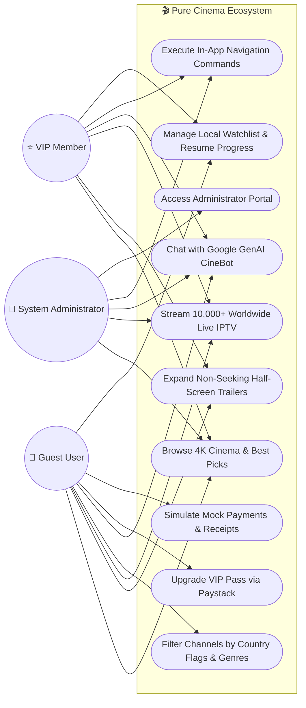
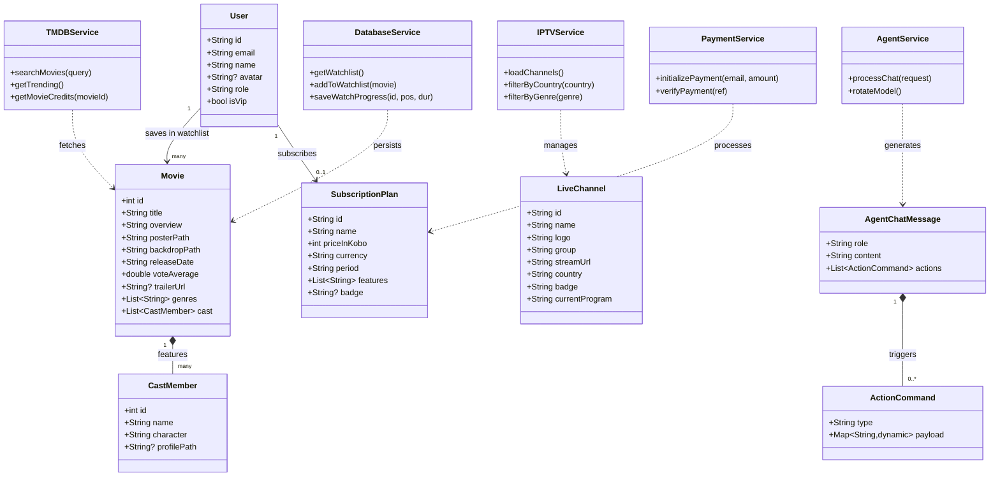
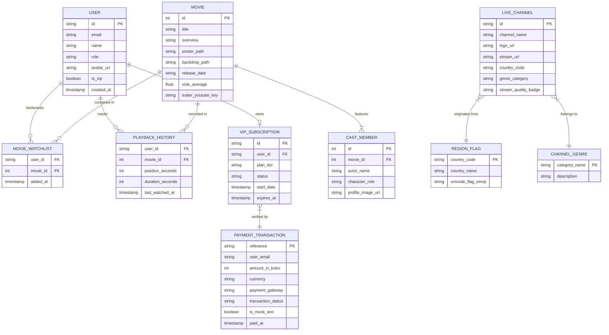
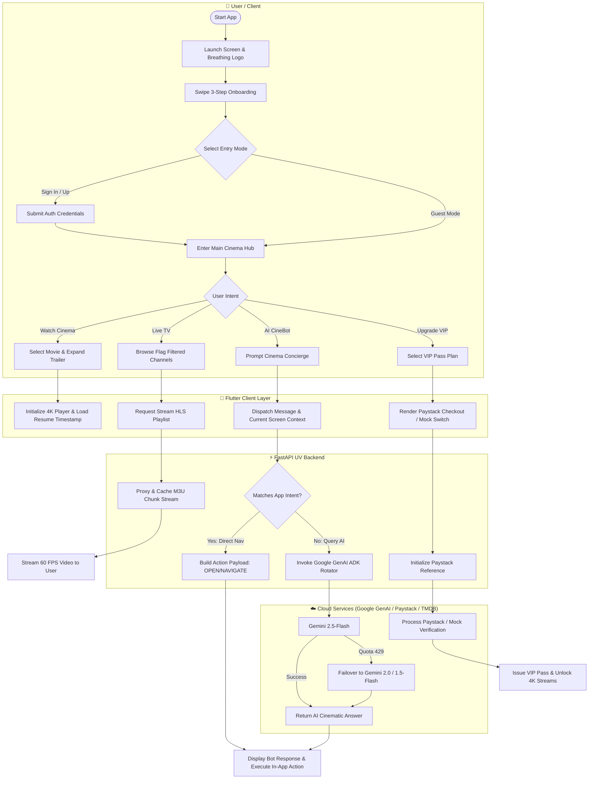
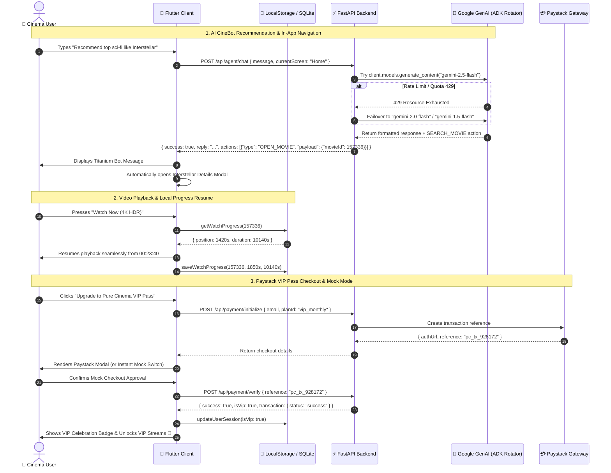

<div align="center">

# 🎬 PURE CINEMA
### *Uncompromised 4K Cinema Streaming · 10,000+ Worldwide Live TV · AI CineBot Concierge*

[](https://flutter.dev)
[](https://fastapi.tiangolo.com)
[](https://python.org)
[](https://aistudio.google.com)
[](https://paystack.com)
[](https://render.com)
[](LICENSE)

<br/>

**Pure Cinema** is a state-of-the-art cross-platform streaming platform built with **Flutter** (Web, iOS, Android, Desktop) and a high-performance **FastAPI** backend. It blends ultra-high-definition cinema streaming, 10,000+ international live television channels, a silicon brushed titanium AI assistant powered by Google GenAI ADK, and seamless VIP subscription monetization.

---

</div>

## 🌟 Highlights & Features

### 🎞️ 1. Ultra HD 4K Cinema & Auto-Playing Trailers
- **Non-Seeking Half-Screen Player**: Expanded half-screen cinema overview that auto-plays HD trailers with audio toggles, expand-to-fullscreen capabilities, and touch-friendly controls.
- **Smart Recommendations & Best Picks**: Curated "Best Picks" legal streaming catalog powered by TMDB metadata, high-resolution backdrops, and cast filmographies.
- **Instant Resume & Playback History**: Client-side storage tracks watched seconds, durations, and auto-generates "Continue Watching" rails.

### 📺 2. 10,000+ Worldwide Live TV Channels
- **Global Broadcasts**: 10,000+ 24/7 channels categorized by Movies, News, Sports, Documentaries, Music, Entertainment, and Kids.
- **Authentic National Flags**: Real Unicode country flags (🇺🇸, 🇬🇧, 🇫🇷, 🇩🇪, 🇪🇸, 🇮🇹, 🇯🇵, 🇰🇷, 🇳🇬, 🇧🇷, 🇿🇦, 🇮🇳, 🇦🇺) across channel cards and filter chips.
- **Resilient Multi-Source Streaming**: Native HLS stream parser with chunked VLC proxying on the FastAPI backend for low latency and zero buffer stalls.

### 🤖 3. Silicon Metal AI CineBot (Google GenAI ADK)
- **Multi-Model Rotator & Auto-Failover**: Rotates dynamically across Google GenAI free-tier models (`gemini-2.5-flash`, `gemini-2.0-flash`, `gemini-1.5-flash`, `gemini-1.5-pro`, `gemini-2.0-flash-lite`) with instant exception handling if rate limits occur.
- **In-App Action Execution**: The CineBot can autonomously navigate between tabs (`OPEN_MOVIE`, `SEARCH_MOVIE`, `NAVIGATE_TAB`, `ADD_WATCHLIST`) via structured JSON action protocols.
- **Brushed Titanium Industrial Design**: Minimalist Apple/Silicon-inspired floating metal badge with zero annoying green glow.

### 💳 4. Paystack VIP Subscription Gateway & Mock Mode
- **VIP Passes**: Monthly, Quarterly, and Annual VIP passes unlocking 4K Ultra HD streams and exclusive cinema channels.
- **Instant Mock Mode Toggle**: Seamless in-app mock mode switch allowing developers and testers to simulate end-to-end checkout flows with zero live billing.

### 🎨 5. Premium Cinematic Aesthetics
- **S-Core Dream Typography**: Exquisite Korean/Latin modern typographic hierarchy throughout brand headers, titles, and modals.
- **Living Breathing Logo**: Sine-wave breathing scale pulse with dynamic `#E50914` crimson ambient halo.
- **Floating Capsule Dock Navbar**: Floating obsidian glass capsule dock with active white pill button and dark icon glyphs.
- **3-Step Cinematic Onboarding**: Fluid swipeable master onboarding flow leading to dedicated Sign In / Sign Up screens with guest bypass.

---

## 📐 System Design & UML Diagrams

### 1. 🎯 Use Case Diagram
Illustrates interactions between system actors (**Guest User**, **VIP Member**, and **System Administrator**) and core Pure Cinema subsystems.



---

### 2. 🏛️ Class Diagram (Architecture & Relationships)
Shows structural object-oriented relationships between core data models, client controllers, and service handlers.



---

### 3. 🗄️ Entity Relationship Diagram (ERD)
Defines the pure data schema, attributes, and relationships across persistent entities (without behavioral methods).



---

### 4. 🏊 Activity Diagram with Swimlanes
Maps cross-functional workflows across the **User**, **Flutter Client**, **FastAPI Backend**, and **Cloud Providers**.



---

### 5. 🔄 Sequence Diagram (End-to-End Discovery & Checkout)
Details synchronous and asynchronous message exchanges during an AI-driven movie discovery and VIP Pass checkout lifecycle.



---

## 📁 Repository Structure

```text
pure_cinema_flutter/
├── lib/                               # Flutter Frontend Codebase
│   ├── models/                        # Movie, Cast, LiveChannel data schemas
│   ├── screens/
│   │   ├── splash_screen.dart         # Living breathing logo splash
│   │   ├── onboarding_screen.dart     # 3-step cinematic onboarding
│   │   ├── sign_in_screen.dart        # Dedicated authentication screen
│   │   ├── sign_up_screen.dart        # Dedicated registration screen
│   │   ├── landing_screen.dart        # Cinematic brand landing & guest entry
│   │   ├── main_nav_screen.dart       # Floating capsule dock navigator
│   │   ├── home_screen.dart           # Hero banner, auto-trailers, best picks
│   │   ├── live_tv_screen.dart        # 10,000+ live channels with national flags
│   │   ├── search_screen.dart         # Instant movie & genre search
│   │   ├── watchlist_screen.dart      # Saved cinema titles & continue watching
│   │   ├── profile_screen.dart        # Account settings & VIP pass upgrade
│   │   └── agent_chat_screen.dart     # Titanium AI CineBot conversation modal
│   ├── services/
│   │   ├── agent_service.dart         # CineBot communication client
│   │   ├── auth_service.dart          # Session manager & offline fallback
│   │   ├── database_service.dart      # LocalStorage & SQLite repository
│   │   ├── iptv_service.dart          # Live TV stream coordinator
│   │   ├── payment_service.dart       # Paystack & Mock transaction service
│   │   └── tmdb_service.dart          # Movie metadata & backdrop client
│   ├── theme/                         # S-Core Dream typography & colors
│   └── widgets/                       # Reusable UI widgets & modals
├── backend/                           # FastAPI UV Backend
│   ├── app/
│   │   ├── models/schemas.py          # Pydantic schemas & action flags
│   │   ├── routers/                   # API routes (agent, auth, iptv, payment)
│   │   ├── services/                  # Agent rotator, IPTV parser, TMDB cache
│   │   ├── config.py                  # Environment settings
│   │   └── main.py                    # FastAPI entrypoint & CORS middleware
│   ├── pyproject.toml                 # UV dependency management
│   ├── requirements.txt               # PIP dependencies for cloud builders
│   └── run.py                         # Production server launcher
├── web/                               # Web runner, PWA icons, breathing splash
├── render.yaml                        # 1-Click Render Blueprint infrastructure
└── README.md                          # You are here!
```

---

## ⚡ Quick Start Guide

### Prerequisites
- **Flutter SDK**: `3.x+` ([Install Flutter](https://flutter.dev/docs/get-started/install))
- **Python**: `3.10+` ([Install Python](https://python.org))
- **UV** (Optional, recommended): `pip install uv`

---

### 1. Run the FastAPI Backend

```bash
# Navigate to backend folder
cd backend

# Install dependencies and start server with hot reload
uv run python run.py

# Or with standard Python / Uvicorn:
# pip install -r requirements.txt
# uvicorn app.main:app --host 0.0.0.0 --port 3000 --reload
```
> **Backend URL**: `http://localhost:3000`  
> **API Health Check**: `http://localhost:3000/health`

---

### 2. Run the Flutter App

Open a second terminal in the project root:

```bash
# Run on Chrome / Desktop Browser
flutter run -d chrome

# Or run with HTML renderer (optimized for iPhone / Safari on local Wi-Fi)
flutter run -d web-server --web-hostname 0.0.0.0 --web-port 8090 --web-renderer html
```
> **Access from Mobile**: Open Safari on your phone and visit `http://YOUR_LOCAL_IP:8090` (e.g. `http://192.168.1.245:8090`).

---

## 🔑 Environment Configuration

Create a `.env` file in the `backend/` directory (see [`backend/.env.example`](backend/.env.example)):

| Variable | Description | Default / Required |
| :--- | :--- | :--- |
| `HOST` | Backend host binding | `0.0.0.0` |
| `PORT` | Backend port | `3000` |
| `TMDB_API_KEY` | TMDB API key for movie metadata & trailers | Required for live TMDB |
| `GEMINI_API_KEY` | Google Gemini API key (powers AI CineBot) | Required for Gemini ADK |
| `PAYSTACK_SECRET_KEY` | Paystack secret key for VIP subscriptions | Optional (uses Mock Mode if unset) |
| `PAYSTACK_PUBLIC_KEY` | Paystack public key | Optional (uses Mock Mode if unset) |
| `JWT_SECRET` | Secret key for signing auth tokens | Any 64-char string |
| `DATABASE_URL` | Optional PostgreSQL / Supabase connection | Optional (uses client storage) |

---

## 🚀 Cloud Deployment

### Backend on Render (1-Click Blueprint)
The repository includes a ready-to-use [`render.yaml`](render.yaml) specification:
1. Go to [dashboard.render.com](https://dashboard.render.com/) $\rightarrow$ **New +** $\rightarrow$ **Blueprint**.
2. Select your repository: `JaimeCabary/Pure-Cinema-Flutter`.
3. Render automatically provisions your FastAPI web service and configures health checks.
4. **Live Production URL**: `https://pure-cinema-backend.onrender.com`

### Frontend on Render Static Site / Netlify / Vercel
1. Build the production web bundle:
   ```bash
   flutter build web --release
   ```
2. Deploy the `build/web` folder to:
   - **Render Static Site**: Build command: `git clone https://github.com/flutter/flutter.git --depth 1 -b stable flutter-sdk && export PATH="$PATH:\`pwd\`/flutter-sdk/bin" && flutter build web --release`, Publish directory: `build/web`.
   - **Netlify Drop**: Drag `build/web` into [app.netlify.com/drop](https://app.netlify.com/drop).
   - **Vercel**: Run `npx -y vercel --prod build/web`.

---

## 💡 Access Modes

- **Guest Access**: Tap **"ENTER AS GUEST"** on the landing screen for instant zero-friction cinema streaming.
- **Member Access**: Create an account or sign in to save your personal watchlists and track watch history across sessions.

---

## 📄 License

Distributed under the **MIT License**. See `LICENSE` for more information.

<div align="center">
  <br/>
  <b>Pure Cinema Studios · 2026</b>
  <br/>
  <i>Crafted with passion for cinema lovers worldwide.</i>
</div>
